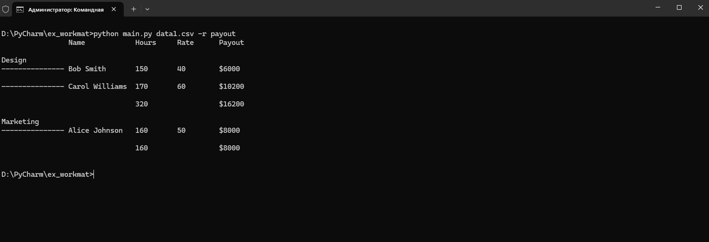

Скрипт по формированию отчетов

Используются только стандартные библиотеки Python. Для тестов использована библиотека pytest.

Запуск скрипта осуществляется командой python3 main.py *files* --report *report*, где files - список путей к файлам, report - название отчета.

Реализован только 1 отчет с именем payout.

Возможно добавление новых отчетов путей написание отдельный функции для него и указания его в конструкции *match*.

Сам скрипт создает свое подобие таблицы на основе словаря. Ключи - шапка csv файла, значения - список строк по порядку, взятый из каждого файла.
Для правильного распределения значений предварительно вычисляется позиция каждого ключа в шапке.

Функциональные требования:
 - можно передать пути к файлам
 - можно указать название отчета
 - можно сформировать отчет payout

Не функциональные требования:
 - используется только стандартная библиотека
 - не использована библиотека csv
 - код покрыт тестами на pytest
 - код соответствует:
    - общепринятым стандартам написания проектов на python
    - общепринятому стилю 

